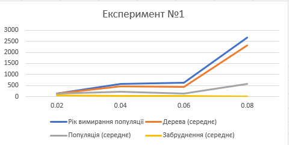
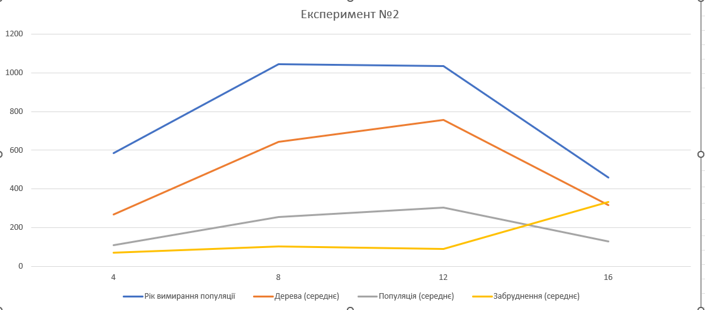
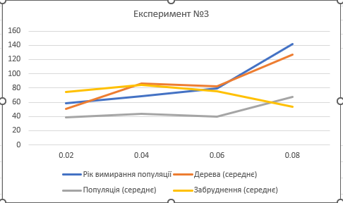

## Комп'ютерні системи імітаційного моделювання
## СПм-22-5, **Махічев Євгеній Віталійович**
### Лабораторна робота №**1**. Опис імітаційних моделей та проведення обчислювальних експериментів

 

### Варіант 4, модель у середовищі NetLogo:
[Urban Suite - Pollution](http://www.netlogoweb.org/launch#http://www.netlogoweb.org/assets/modelslib/Curricular%20Models/Urban%20Suite/Urban%20Suite%20-%20Pollution.nlogo)

 

### Вербальний опис моделі:
Модель "Urban Suite - Pollution" є дослідженням вразливої рівноваги екосистеми хижак-жертва. У закритому середовищі конкурують популяції людей, ландшафтних елементів та зграї аерозольних забруднюючих агентів за ресурси. 
Модель дозволяє вивчати динаміку популяцій та спостерігати за регулярними чи нерегулярними циклами їхнього розмноження протягом часу. Регулярні - вказують на стабільність в екосистемі, де популяції зберігаються з часом. Нерегулярні - свідчать про нестабільність і можуть призвести до потенційного вимирання обох взаємозалежних популяцій. Модель встановлює негативний зворотний зв'язок: хижаки гальмують щільність жертв, а жертви стимулюють щільність хижаків.

### Керуючі параметри:
- **initial-population** Початкова кількість населення у місті: контролює кількість людей, створених на початку запуску моделі.
- **birth-rate** Швидкість приросту населення міста: контролює ймовірність кожної людини створити потомство протягом певного періоду.
- **planting-rate** Швидкість посадки дерев для зменшення забруднення: контролює ймовірність, що людина буде садити дерево щорічно.
- **power-plants** Початкова кількість електростанцій у місті: контролює кількість електростанцій, створених на початку запуску моделі.
- **polluting-rate** Забруднення, яке виділяє кожна електростанція за рік: поширюється на навколишню територію і визначає його вплив на здоров'я людей

### Внутрішні параметри:
- **people** Кількість населення в місті.
- **trees** Кількість дерев у місті.
- **pollution** Рівень забруднення в екосистемі.

### Показники роботи системи:
- **Динаміка висадження дерев** Оцінка кількості нових дерев, які були посаджені, відображаючи зусилля у напрямку покращення екосистеми.
- **Зміни в чисельності населення** Визначення тенденцій у розмірі населення, що дозволяє відслідковувати вплив інших факторів на динаміку населення міста.
- **Рівень забруднення** Оцінка впливу електростанцій на рівень забруднення повітря, спрощуючи аналіз його впливу на навколишнє середовище.

### Примітки:
При налаштуваннях керуючих параметрів за замовчуванням, популяції зазнають вимирання, проте тривалість їхнього існування має значні варіації.

### Недоліки моделі:
- Не враховує появу технологій та інновацій, які можуть впливати на забруднення.
- Модель не бере до уваги географічні особливості, які можуть впливати на поширення забруднення та інші аспекти екосистеми.

 

## Обчислювальні експерименти
### 1. Вплив швидкості посадки дерев на динаміку популяції
Досліджується вплив кількості дерев на динаміку популяції в екосистемі. Визначається, як змінюється рівень забруднення при зміні кількості дерев. Експерименти проводяться при 0.02-0.08 швидкості посадки дерев, з кроком 0.02, усього 4 симуляцій.
Інші керуючі параметри мають значення за замовчуванням:
- **initial-population**: 30;
- **birth-rate**: 0,1;
- **power-plants**: 2;
- **polluting-rate**: 3.
<table>
<thead>
<tr><th>Швидкість висадження дерев</th><th>Рік вимирання популяції</th><th>Дерева (середнє)</th><th>Популяція (середнє)</th><th>Забруднення (середнє)</th></tr>
</thead>
<tbody>
<tr><td>0,02</td><td>139</td><td>125</td><td>140</td><td>50,70</td></tr>
<tr><td>0,04</td><td>584</td><td>456</td><td>227,98</td><td>19,78</td></tr>
<tr><td>0,06</td><td>628</td><td>425</td><td>143,19</td><td>24,9</td></tr>
<tr><td>0,08</td><td>2680</td><td>2303</td><td>578</td><td>5,03</td></tr>
</tbody>
</table>

Висновки: 
1. **Взаємозв'язок між кількістю Дерев і станом Популяції:**
   - При збільшенні кількості дерев зафіксоване збільшення тривалості життя, і зменшення середнього рівня забруднення.

2. **Забруднення та швидкість Посадки:**
   - Зі збільшенням швидкості посадки дерев знижується середній рівень забруднення, що свідчить про позитивний вплив збільшення кількості дерев на екосистему.

Загальною висновок є те, що збільшення швидкості посадки дерев сприяє покращенню стану популяції та зменшенню забруднення в екосистемі.
### 2. Вплив кількісті електростанцій на динаміку популяції
Досліджується, як зміна кількісті електростанцій впливає на динаміку популяції в екосистемі. Експерименти проводяться при 4-16 електростанцій, з кроком 4, усього 4 симуляцій.
Інші керуючі параметри мають значення за замовчуванням:
- **initial-population**: 30;
- **birth-rate**: 0,1;
- **planting-rate**: 0,05;
- **polluting-rate**: 3.
<table>
<thead>
<tr><th>Кількість електростанцій</th><th>Рік вимирання популяції</th><th>Дерева (середнє)</th><th>Популяція (середнє)</th><th>Забруднення (середнє)</th></tr>
</thead>
<tbody>
<tr><td>4</td><td>586</td><td>266,65</td><td>108,51</td><td>69,99</td></tr>
<tr><td>8</td><td>1046</td><td>642,97</td><td>256,67</td><td>102</td></tr>
<tr><td>12</td><td>1034</td><td>757,55</td><td>303,74</td><td>88,51</td></tr>
<tr><td>16</td><td>459</td><td>317,53</td><td>128,89</td><td>332,37</td></tr>
</tbody>
</table>

Висновки: 

1. **Вплив кількості електростанцій на кількість дерев та популяцію:**
   - Зі збільшенням кількості електростанцій відзначається зменшення середньої кількості дерев. Це свідчить про негативний вплив збільшення кількості електростанцій на екосистему.

2. **Забруднення та кількість Електростанцій:**
   - Із збільшенням кількості електростанцій спостерігається зростання середнього рівня забруднення. Це свідчить про те, що електростанції вносять значний внесок у забруднення екосистеми.

### 3. Вплив швидкості приросту населення на динаміку популяції
Досліджується, як зміна швидкісті приросту населення впливає на динаміку популяції в екосистемі. Експерименти проводяться при 0.02-0.08, з кроком 0.02, усього 4 симуляцій.
Інші керуючі параметри мають значення за замовчуванням:
- **initial-population**: 30;
- **power-plants**: 2;
- **planting-rate**: 0,05;
- **polluting-rate**: 3.
<table>
<thead>
<tr><th>Швидкість приросту населення</th><th>Рік вимирання популяції</th><th>Дерева (середнє)</th><th>Популяція (середнє)</th><th>Забруднення (середнє)</th></tr>
</thead>
<tbody>
<tr><td>0,02</td><td>59</td><td>50,48</td><td>38,83</td><td>74,64</td></tr>
<tr><td>0,04</td><td>68</td><td>86,34</td><td>44,1</td><td>84,08</td></tr>
<tr><td>0,06</td><td>79</td><td>82,23</td><td>39,82</td><td>75</td></tr>
<tr><td>0,08</td><td>142</td><td>127</td><td>67,9</td><td>53,83</td></tr>
</tbody>
</table>

Висновки: 

1. **Зв'язок між швидкістю приросту та кількістю дерев:**
   - Зі збільшенням швидкості приросту населення спостерігається збільшення середньої кількості дерев.

2. **Вплив швидкості приросту на популяцію та забруднення:**
   - Зі збільшенням швидкості приросту населення відзначається збільшення кількості людей, однак також спостерігається зростання середнього рівня забруднення.
