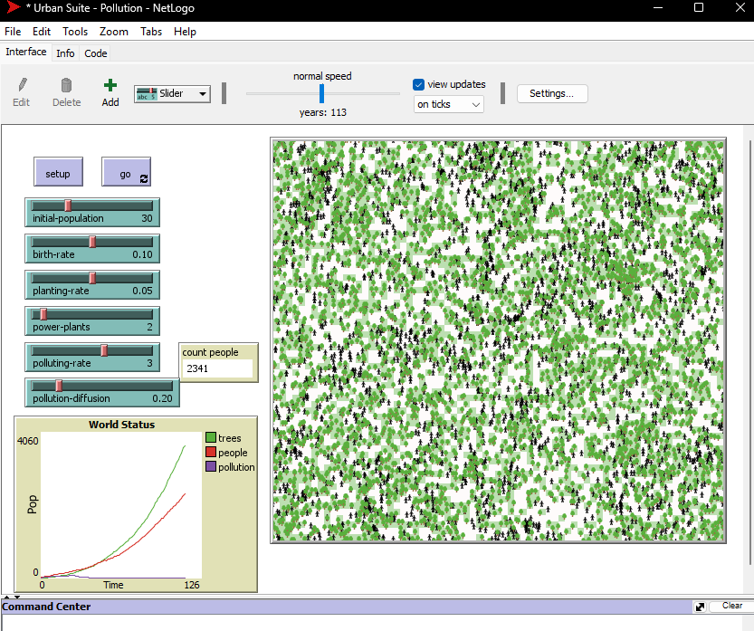
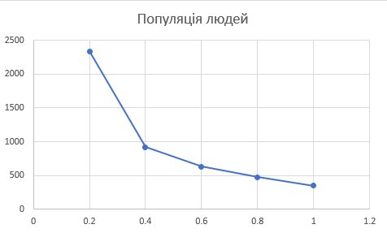

## Комп'ютерні системи імітаційного моделювання
## СПм-22-5, **Махічев Євгеній Віталійович**
### Лабораторна робота №**2**. Редагування імітаційних моделей у середовищі NetLogo

 

### Варіант 4, модель у середовищі NetLogo:
[Urban Suite - Pollution](http://www.netlogoweb.org/launch#http://www.netlogoweb.org/assets/modelslib/Curricular%20Models/Urban%20Suite/Urban%20Suite%20-%20Pollution.nlogo)

 

### Внесені зміни у вихідну логіку моделі, за варіантом:

**Реалізувати позитивний вплив наявності на імітаційному полі електростанцій на вірогідність появи нових людей.** 

Змінено процедуру **reproduce**. Кожна станція на полі тепер дає 0.5% вірогідність появи нових людей:
<pre>
  to reproduce  ;; person procedure
  if health > 4 and random-float 1 < (birth-rate + (power-plants / 200)) [
    hatch-people 1 [
      set health 5
    ]
  ]
end
</pre>

**Збільшити вірогідність висадки дерев у клітинах поблизу електростанцій**

Змінено процедуру maybe-plant, яка відповідає за висадження дерев. Якщо людина в радіусі 3 патчів бачить електростанцію, то шанс висадити дерево в нинішньому патчі зростає вдвічі.
<pre>
  to maybe-plant  ;; person procedure
  let nearby-patches patches in-radius 3
  let patch-power-plant one-of nearby-patches with [is-power-plant?]
  let power-plant-rate 0
  if patch-power-plant != nobody [
    set power-plant-rate planting-rate * 2
  ]
  if random-float 1 < planting-rate + power-plant-rate [
    hatch-trees 1 [
      set health 5
      set color green
    ]
  ]
end
</pre>

### Внесені зміни у вихідну логіку моделі, на власний розсуд:

**Додано обмеження на максимальну кількість людей в моделі**
При деяких налаштуваннях люди можуть безконтрольно розмножуватись. Це сильно тормозить систему і не має ніякого сенсу. Є природні обмеження на кількість людей на деякій території. Тепер людей не може бути більше 20 000.
<pre>
  to reproduce  ;; person procedure
  if health > 4 and random-float 1 < (birth-rate + (power-plants / 200)) and count people < 20000 [
    hatch-people 1 [
      set health 5
    ]
  ]
end
</pre>

**Зміна логіки забруднення**
Забруднення тепер також залежне від кількості людей. Чим більше людей, тим активніше вони використовують електростанції і тим більше електростанції працюють і забруднюють середовище. Кожні 1 000 людей додають 0.5 сили забруднення (процедура pollute):
<pre>
  set pollution polluting-rate + (count people / 100 * 0.05)
</pre>

Також додано слайдер для зміни розповсюдження забруднення. Чим більше, тим далі розповсюджується забруднення від електростанцій:
<pre>
  diffuse pollution pollution-diffusion
</pre>

Фінальний код моделі та її інтерфейс доступні за 
[посиланням](Model.nlogo)

 

## Обчислювальні експерименти 
### 1. Вплив розповсюдження забруднення на популяцію людей
Досліджується, як зміна сили розповсюдження забруднення впливає на динаміку популяції в екосистемі через 100 тіків. Експерименти проводяться при 0.2-1.0 розповсюдження забруднення, з кроком 0.2, усього 5 симуляцій.
Інші керуючі параметри мають значення за замовчуванням:
- **initial-population**: 30;
- **birth-rate**: 0,1;
- **planting-rate**: 0,05;
- **power-plants**: 2;
- **polluting-rate**: 3.
<table>
<thead>
<tr><th>Розповсюдження забруднення</th><th>Популяція людей</th></tr>
</thead>
<tbody>
<tr><td>0.2</td><td>2341</td></tr>
<tr><td>0.4</td><td>922</td></tr>
<tr><td>0.6</td><td>632</td></tr>
<tr><td>0.8</td><td>475</td></tr>
<tr><td>1.0</td><td>346</td></tr>
</tbody>
</table>

Висновки: 
Зі збільшенням сили розповсюдження забруднення спостерігається зменшення популяції людей. Це свідчить про те, що висока концентрація забруднення негативно впливає на здоров'я та життєздатність популяції.

